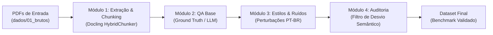

# 🔬 Pipeline para Geração de Datasets de Avaliação de Sistemas RAG

Pipeline automatizado e modular para síntese e auditoria de **Datasets de Benchmark (Padrão-Ouro / Ground Truth)** destinados ao teste de estresse de sistemas RAG sob variações linguísticas, estilos de consulta e ruídos no **Português do Brasil**.

> **Caso de Aplicação / Validação Experimental**: Documentos públicos de licitações e contratações brasileiras (Editais, Termos de Referência, Planilhas Orçamentárias, Cadernos de Encargos e Anexos), selecionados por sua alta complexidade textual, multimodalidade, tabelas financeiras e relacionamentos interdocumentais.

---

## 🔄 Fluxo do Pipeline



---

## 🧩 Visão Geral dos Módulos

Cada etapa do projeto vive em sua própria pasta dentro de `modulos/`, com código, configurações e documentação específicos:

| Módulo | Pasta | O que faz | Entrada | Saída |
| :--- | :--- | :--- | :--- | :--- |
| **01. Extração & Chunking** | [`modulos/etapa1_extracao/`](file:///c:/Users/paulo/OneDrive/%C3%81rea%20de%20Trabalho/Cursos%20e%20Educa%C3%A7%C3%A3o/ARTIGO%20MESTRADO/modulos/etapa1_extracao/) | Ingestão vetorial e análise de layout via Docling (DocLayNet), reconstrução de tabelas (TableFormer) e *Layout-Aware Chunking* (HybridChunker) | Arquivos `.pdf` | `<doc>.md`, `chunks.json` e `indice_chunks_consolidado.json` |
| **02. QA Base** | [`modulos/etapa2_geracao_qa/`](file:///c:/Users/paulo/OneDrive/%C3%81rea%20de%20Trabalho/Cursos%20e%20Educa%C3%A7%C3%A3o/ARTIGO%20MESTRADO/modulos/etapa2_geracao_qa/) | Formulação de perguntas canônicas e respostas padrão-ouro factuais com rastreabilidade | Chunks estruturados | `qa_base.json` (Gabarito Oficial) |
| **03. Estilos & Ruídos** | [`modulos/etapa3_estilos_ruidos/`](file:///c:/Users/paulo/OneDrive/%C3%81rea%20de%20Trabalho/Cursos%20e%20Educa%C3%A7%C3%A3o/ARTIGO%20MESTRADO/modulos/etapa3_estilos_ruidos/) | Injeção de 4 dimensões de variação linguística do usuário real (informalidade, erudição, polidez, erros/typos) | `qa_base.json` | `qa_diversificado.json` |
| **04. Auditoria** | [`modulos/etapa4_avaliacao/`](file:///c:/Users/paulo/OneDrive/%C3%81rea%20de%20Trabalho/Cursos%20e%20Educa%C3%A7%C3%A3o/ARTIGO%20MESTRADO/modulos/etapa4_avaliacao/) | Controle de qualidade e eliminação de desvio semântico (*Semantic Drift*, corte de similaridade $> 0.70$) | `qa_diversificado.json` | `dataset_benchmark_final.json` |

---

## 📂 Estrutura de Pastas e Dados

```text
ARTIGO MESTRADO/
│
├── CHECKPOINT.md                     <- Resumo do estado do projeto para retomar novas sessões
├── README.md                         <- Documentação geral e guia do repositório
├── executar_pipeline.py              <- Orquestrador CLI principal para executar qualquer módulo
│
├── dados/                            <- Ciclo de vida dos dados gerados no benchmark
│   ├── 01_brutos/                    <- PDFs originais de editais, contratos e anexos
│   ├── 02_chunks/                    <- Markdown integral, chunks por documento e índice consolidado
│   ├── 03_qa_base/                   <- Perguntas canônicas padrão-ouro (Ground Truth)
│   ├── 04_qa_diversificado/          <- Perguntas perturbadas nas 4 dimensões de ruído
│   └── 05_relatorios/                <- Relatórios de auditoria e dataset final filtrado
│
├── modulos/                          <- Código-fonte modular do pipeline
│   ├── etapa1_extracao/              <- Extrator Docling, configurações, HybridChunker e README
│   ├── etapa2_geracao_qa/            <- Prompts e gerador de perguntas canônicas
│   ├── etapa3_estilos_ruidos/        <- Prompts de perturbação linguística e gerador de ruídos
│   └── etapa4_avaliacao/             <- Métricas de similaridade semântica e filtros de descarte
│
└── referencias/                      <- Obras científicas e base teórica do mestrado
    ├── fichamentos/                  <- 9 Fichas de leitura acadêmicas detalhadas + README catálogo
    └── *.pdf                         <- Artigos científicos em PDF armazenados localmente
```

---

## 🚀 Como Executar

O pipeline pode ser executado pelo script orquestrador na raiz ou diretamente pelo script específico de cada módulo:

### 1. Executar a Extração de Documentos (Módulo 1)
Coloque os PDFs desejados na pasta `dados/01_brutos/` e execute:
```bash
python executar_pipeline.py
# ou explicitamente:
python executar_pipeline.py -m 1
```
> ⚡ **Processamento Incremental**: Por padrão, o extrator detecta documentos que já possuem chunks extraídos e os pula instantaneamente (processamento a >900 docs/s via cache).

### 2. Forçar Reprocessamento Total (`--force` / `-f`)
Se você alterar algum parâmetro de chunking ou desejar refazer a extração de todos os documentos:
```bash
python executar_pipeline.py -m 1 --force
# ou
python modulos/etapa1_extracao/extrator.py --force
```

### 3. Executar Outros Módulos ou Pipeline Completo
```bash
python executar_pipeline.py -m 2       # Apenas Geração de QA Base
python executar_pipeline.py -m 3       # Apenas Estilos e Ruídos
python executar_pipeline.py -m 4       # Apenas Auditoria Semântica
python executar_pipeline.py -m todos   # Pipeline completo ponta a ponta
```

---

## 🔬 Fundamentação Metodológica do Módulo 01

A estratégia de segmentação documental adotada neste projeto supera as divisões cegas por tamanho fixo (*fixed-size sliding window*):
* **Layout-Aware Chunking**: Adota o `HybridChunker` padrão do **Docling (Auer et al., 2024)**, respeitando as fronteiras naturais de seções, parágrafos e tabelas complexas sem cortar frases ao meio.
* **Prevenção de Truncamento**: Embasado no levantamento de **Gao et al. (2024)** (*Retrieval-Augmented Generation for Large Language Models: A Survey*), que demonstra que partições baseadas puramente em contagens numéricas fragmentam tabelas e degradam a recuperação.
* **Tabelas em Trincas Semânticas**: Tabelas são linearizadas em trincas (`Linha, Coluna = Valor`), garantindo que cada dado mantenha o cabeçalho associado mesmo se a tabela for dividida entre múltiplos blocos.
* **Hardware e Portabilidade**:
  * Aceleração automática por GPU (`CUDA`) para inferência rápida dos modelos de visão (**DocLayNet** e **TableFormer**);
  * Chaveamento transparente para `CPU` caso executado em computadores sem placa de vídeo dedicada;
  * `DO_OCR = False` por padrão para máxima velocidade e economia de VRAM em PDFs nativos digitais.

---

## 📚 Catálogo de Referências e Fichamentos

Todos os artigos científicos que fundamentam este mestrado estão disponíveis na pasta [`referencias/`](file:///c:/Users/paulo/OneDrive/%C3%81rea%20de%20Trabalho/Cursos%20e%20Educa%C3%A7%C3%A3o/ARTIGO%20MESTRADO/referencias/).

Para cada obra, mantemos uma ficha de leitura estruturada em [`referencias/fichamentos/`](file:///c:/Users/paulo/OneDrive/%C3%81rea%20de%20Trabalho/Cursos%20e%20Educa%C3%A7%C3%A3o/ARTIGO%20MESTRADO/referencias/fichamentos/), contendo:
- Metodologia, datasets e modelos testados;
- Explicação prática das métricas utilizadas (*RAGAS, mAP, Faithfulness, Context Relevance, Jaccard*);
- Limitações admitidas pelos autores (gaps de pesquisa);
- **Instruções práticas de como e onde citar a obra** na dissertação (Introdução, Metodologia, Trabalhos Relacionados e Discussão).

Consulte o [Catálogo Geral de Fichamentos](file:///c:/Users/paulo/OneDrive/%C3%81rea%20de%20Trabalho/Cursos%20e%20Educa%C3%A7%C3%A3o/ARTIGO%20MESTRADO/referencias/fichamentos/README.md) para navegar pelas 9 obras catalogadas.
