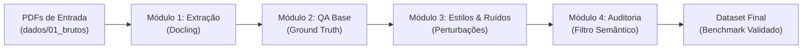

# 🔬 Pipeline para Geração de Datasets de Avaliação de Sistemas RAG

Pipeline automatizado e modular para síntese e auditoria de **Datasets de Benchmark (Padrão-Ouro / Ground Truth)** destinados ao teste de estresse de sistemas RAG sob variações linguísticas, estilos de consulta e ruídos no **Português do Brasil**.

> **Caso de Aplicação / Validação Experimental**: Documentos públicos de licitações brasileiras (Editais, Termos de Referência, Planilhas Orçamentárias e Anexos), selecionados por sua alta complexidade textual, multimodalidade e relacionamentos interdocumentais.

---

## 🔄 Fluxo do Pipeline



---

## 🧩 Visão Geral dos Módulos

Cada etapa do projeto vive em sua própria pasta dentro de `modulos/`, com código, configurações e documentação específicos:

| Módulo | Pasta | O que faz | Entrada | Saída |
| :--- | :--- | :--- | :--- | :--- |
| **01. Extração** | [`modulos/etapa1_extracao/`](file:///c:/Users/paulo/OneDrive/%C3%81rea%20de%20Trabalho/Cursos%20e%20Educa%C3%A7%C3%A3o/ARTIGO%20MESTRADO/modulos/etapa1_extracao/) | Ingestão e OCR inteligente via Docling com GPU | Arquivos `.pdf` | Markdown, imagens (`.png`) e tabelas (`.csv`) |
| **02. QA Base** | [`modulos/etapa2_geracao_qa/`](file:///c:/Users/paulo/OneDrive/%C3%81rea%20de%20Trabalho/Cursos%20e%20Educa%C3%A7%C3%A3o/ARTIGO%20MESTRADO/modulos/etapa2_geracao_qa/) | Formulação de perguntas canônicas e respostas padrão-ouro com rastreabilidade | Chunks extraídos | `qa_base.json` (Gabarito) |
| **03. Estilos & Ruídos** | [`modulos/etapa3_estilos_ruidos/`](file:///c:/Users/paulo/OneDrive/%C3%81rea%20de%20Trabalho/Cursos%20e%20Educa%C3%A7%C3%A3o/ARTIGO%20MESTRADO/modulos/etapa3_estilos_ruidos/) | Injeção de 4 dimensões de variação (informal, erudito, polido, erros/typos) | `qa_base.json` | `qa_diversificado.json` |
| **04. Auditoria** | [`modulos/etapa4_avaliacao/`](file:///c:/Users/paulo/OneDrive/%C3%81rea%20de%20Trabalho/Cursos%20e%20Educa%C3%A7%C3%A3o/ARTIGO%20MESTRADO/modulos/etapa4_avaliacao/) | Controle de qualidade e eliminação de desvio semântico (corte de similaridade $> 0.70$) | `qa_diversificado.json` | `dataset_benchmark_final.json` |

---

## 📂 Estrutura de Pastas e Dados

```text
ARTIGO MESTRADO/
│
├── dados/                           <- Ciclo de vida dos dados gerados
│   ├── 01_brutos/                   <- Coloque seus arquivos .pdf aqui
│   ├── 02_chunks/                   <- Textos, tabelas e imagens extraídos
│   ├── 03_qa_base/                  <- Dataset padrão-ouro de perguntas originais
│   ├── 04_qa_diversificado/         <- Perguntas enriquecidas com variações e ruídos
│   └── 05_relatorios/               <- Relatórios de consistência e dataset final auditado
│
├── modulos/                         <- Código-fonte modular do pipeline
│   ├── etapa1_extracao/             <- Extrator Docling, config e README
│   ├── etapa2_geracao_qa/           <- Prompts e gerador de perguntas canônicas
│   ├── etapa3_estilos_ruidos/       <- Prompts de perturbação e gerador de ruídos
│   └── etapa4_avaliacao/            <- Métricas de similaridade e filtros de qualidade
│
├── referencias/                     <- Obras científicas e base teórica
│   ├── fichamentos/                 <- Fichas de leitura com resumos e notas de citação
│   └── *.pdf                        <- Artigos em PDF armazenados
│
└── executar_pipeline.py             <- Script principal para executar qualquer módulo
```

---

## 🚀 Como Executar

### 1. Executar a Extração de Documentos (Módulo 1)
Coloque os PDFs desejados na pasta `dados/01_brutos/` e execute no terminal:
```bash
python executar_pipeline.py
```
*(Por padrão, o comando sem argumentos executa a etapa 1 de extração)*.

### 2. Executar o Pipeline Completo (De Ponta a Ponta)
```bash
python executar_pipeline.py -m todos
```

### 3. Executar Módulos Específicos
Você pode executar qualquer módulo isoladamente pelo seu identificador:
```bash
python executar_pipeline.py -m 1   # Apenas Extração (Docling)
python executar_pipeline.py -m 2   # Apenas Geração de QA Base
python executar_pipeline.py -m 3   # Apenas Estilos e Ruídos
python executar_pipeline.py -m 4   # Apenas Auditoria Semântica
```

---

## 📚 Referências e Fichamentos

Os artigos que fundamentam este trabalho estão guardados na pasta [`referencias/`](file:///c:/Users/paulo/OneDrive/%C3%81rea%20de%20Trabalho/Cursos%20e%20Educa%C3%A7%C3%A3o/ARTIGO%20MESTRADO/referencias/).

Para cada artigo lido, mantemos uma ficha acadêmica em [`referencias/fichamentos/`](file:///c:/Users/paulo/OneDrive/%C3%81rea%20de%20Trabalho/Cursos%20e%20Educa%C3%A7%C3%A3o/ARTIGO%20MESTRADO/referencias/fichamentos/), contendo:
- Metodologia e métricas do artigo original;
- Principais conclusões;
- **Instruções práticas de onde e como citar a obra** na dissertação/artigo de mestrado.
